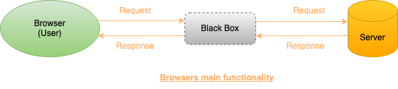
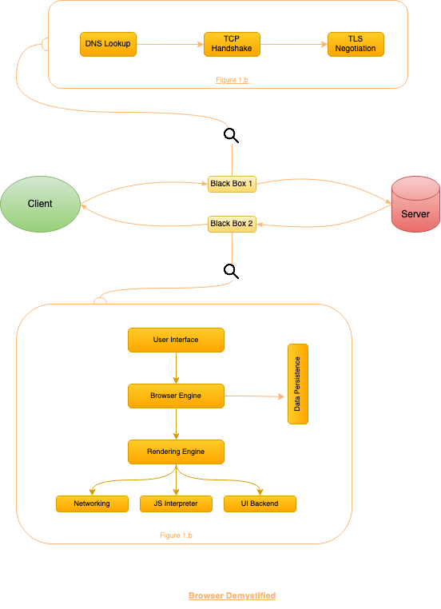

# Assignment 1 - Ex. 1.1

# The Browser

## Magic

The main function of a browser is to present the web resource you choose, by requesting it from the server and displaying it in the browser window. The resource is usually an HTML document, but may also be a PDF, image, or some other type of content. The location of the resource is specified by the user using a URI (Uniform Resource Identifier).

 

As we can see in the above structure there is a Black Box involved between the Browser's main functionality.

Moving forward we'll try to understand what this black box is by demystifying it.

<!-- Let's introduce the above structure with the demystified Black Box - -->
 

## Demystifying the magic

 

Above structure is more specific and in detail in terms of understanding how the browser works.
We dropped the curtains from the Black Box introduced in the previous section diagram.

We have introduced 2 new black boxes in place of the 1. Let's go through what these black boxes are -

**Black Box 1 -**  
Black Box 1 demystifies the internals involved in understanding how the browser makes a connection with the server and starts requesting the resources.

**Black Box 2 -**  
Black Box 1 demystifies the internals involved when the server reverts the resources, and how the browser interprets that response and represents it in a meaningful form.

Each black box of magic has some magical powers. We'll explain each power in detail in the next section.

 

## Blackbox | Toolbox

This section is an explainer for each element described in the diagram in the previous section 

Let's start with the tools of black box 1 -

**DNS Lookup -** The first step of navigating to a web page is finding where the assets for that page are located. Your browser requests a DNS lookup to a name server that responds with an IP Address.

**TCP Handshake -** Once the IP address is known, the browser sets up a connection to the server via *TCP-three-way* handshake. 3 way because for connection setup, the 3 messages are transmitted by TCP to start a TCP session, messages are SYN, SYN-ACK, ACK.

**TLS Negotiation -** For secure connections established over HTTPS, another handshake is required. It determines which cipher will be used to encrypt the communication, verifies the server, and establishes that a secure connection is in place before beginning the actual transfer of data.

Now we understood what's happening behind the scenes in black box 1, similarly, let's go through the black box 2 -

**The User Interface -** The user interface is the space where the User interacts with the browser. It includes the address bar, back and next buttons, home button, refresh and stop, bookmark option, etc. Every other part, except the window where the requested web page is displayed, comes under it.

The Browser Engine: The browser engine works as a bridge between the User interface and the rendering engine. According to the inputs from various user interfaces, it queries and manipulates the rendering engine.

**The Rendering Engine -** The rendering engine, as the name suggests is responsible for rendering the requested web page on the browser screen. The rendering engine interprets the HTML, XML documents and images that are formatted using CSS and generates the layout that is displayed in the User Interface. However, using plugins or extensions, it can display other types of data also. Different browsers use different rendering engines:
* Internet Explorer: Trident
* Firefox & other Mozilla browsers: Gecko
* Chrome & Opera 15+: Blink
* Chrome (iPhone) & Safari: Webkit
    
**Networking -** Component of the browser which retrieves the URLs using the common internet protocols of HTTP or FTP. The networking component handles all aspects of Internet communication and security. The network component may implement a cache of retrieved documents to reduce network traffic.
    
**JavaScript Interpreter -** It is the component of the browser that interprets and executes the javascript code embedded in a website. The interpreted results are sent to the rendering engine for display. If the script is external then first the resource is fetched from the network. Parser keeps on hold until the script is executed.
    
**UI Backend -** UI backend is used for drawing basic widgets like combo boxes and windows. This backend exposes a generic interface that is not platform specific. It underneath uses operating system user interface methods.
    
**Data Persistence/Storage -** This is a persistence layer. Browsers support storage mechanisms such as localStorage, IndexedDB, WebSQL and FileSystem. It is a small database created on the local drive of the computer where the browser is installed. It manages user data such as cache, cookies, bookmarks and preferences.

Now we have demystified both the black boxes, I'm sure upon reaching this point most of you must have a clear vision of what the browser is doing internally.

There are some more terms that we must know to completely understand the browser functionality.

## More tools 

**Parsers -**   
To understand parsers let's first understand what is parsing. Parsing means analyzing and converting a program into an internal format that a runtime environment can run.  
HTML parsed into DOM Tree.  
CSS parsed into CSSOM.

**Order of Script Execution -**   
If we are not dynamically loading scripts or marking them as _defer_ or _async_, then scripts are loaded in the order encountered on the page. It doesn't matter whether it's an external script or an inline script.  
*Async scripts* (regardless of how they are specified as async) load and run in an unpredictable order. The browser loads them in parallel and it is free to run them in whatever order it wants.  
_Defer scripts_ wait until the entire parser is done and then run all scripts marked with defer in the order they were encountered. This allows you to mark several scripts that depend upon one another as deferred.  
*Dynamic Scripts* a script tag is inserted dynamically, how the execution order behaves will depend upon the browser. The newer versions of Firefox default a dynamically added script tag to async unless the script tag has been set otherwise.  

